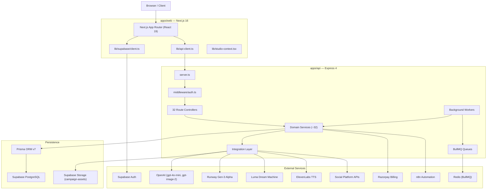

# AI Social Media Studio — Architecture

> **Status:** Current architecture as of `2026-09-18`, branch `master`.
> **Source of Truth:** Verified by completed read-only codebase audit. No architectural changes were made during the audit.
> **Prerequisite:** Read `docs/PROJECT_MEMORY.md` before modifying any component documented here.

---

## 1. System Overview

**AI Social Media Studio (ASM)** is a full-stack, multi-tenant SaaS platform that enables brands and content teams to:

- Transform creative assets (brand images, product photos, long-form content, guidelines) into platform-optimised social media content.
- Generate images and video using AI providers (OpenAI, Runway, Luma, ElevenLabs).
- Distribute content to major social networks (Instagram, Facebook, YouTube, LinkedIn, Threads, Pinterest, TikTok, X/Twitter).
- Govern content through human-in-the-loop approval workflows.
- Schedule and auto-publish content via background workers.
- Meter credits per generation/publishing action and enforce subscription entitlements.
- Automate workflows through n8n webhook integration.

### Major Architectural Layers

| Layer | Technology | Responsibility |
| :--- | :--- | :--- |
| **Frontend** | Next.js 16, React 19, Tailwind CSS v4 | UI, routing, session management, API consumption |
| **API Server** | Express 4, Node.js, TypeScript | Business logic, auth, orchestration, social integrations |
| **Domain Services** | TypeScript service modules | Core business operations (brand, billing, AI, social) |
| **Integration Layer** | Provider registry, social-engine | Platform adapters, AI provider abstraction |
| **Queue / Worker Layer** | BullMQ, embedded tickers | Async generation, publishing, analytics, automation |
| **Database** | Prisma ORM v7, Supabase PostgreSQL | Multi-tenant relational persistence |
| **Auth** | Supabase Auth + custom HMAC admin | User sessions, workspace scoping, admin sessions |
| **Storage** | Supabase Storage (campaign-assets) | Media asset persistence and signed-URL delivery |
| **Billing** | Razorpay | Subscription management and credit metering |

---

## 2. High-Level Architecture



---

## 3. Monorepo Structure

The repository is managed as a single npm workspace monorepo.

```
AI Social Media Studio/
├── apps/
│   ├── api/          Express 4 API server — business logic, routes, workers
│   └── web/          Next.js 16 frontend — UI, routing, session
├── packages/
│   ├── config/       Shared TypeScript base configuration (tsconfig.base.json)
│   ├── database/     Prisma schema, migrations, singleton Prisma client
│   └── shared/       Zod schemas, TypeScript DTOs, shared notification interfaces
├── scripts/          Utility scripts (seed-test-user, verify-integration, browser-qa)
├── tests/            63 test files (unit, integration, provider, security, billing, E2E)
├── docs/             Central project documentation and archived phase reports
│   ├── ARCHITECTURE.md   This file — permanent technical architecture reference
│   ├── CHANGELOG.md      Chronological verified change record
│   ├── deployment.md     Deployment & Monorepo Guide
│   ├── PROJECT_MEMORY.md Permanent architectural source of truth
│   └── archive/          Historical phase reports
├── scratch/          Untracked agent scratch directory (not committed)
```

### Package Responsibilities

| Package | Responsibility |
| :--- | :--- |
| `apps/web` | Next.js frontend: all UI, routing, state, Supabase auth client, API consumption |
| `apps/api` | Express API: all server-side business logic, auth middleware, social integrations, workers |
| `packages/config` | Shared `tsconfig.base.json` extended by both apps and packages |
| `packages/database` | Exports singleton Prisma client; owns `schema.prisma` and migration history |
| `packages/shared` | Single source of truth for Zod validation schemas and DTO TypeScript types |
| `scripts/` | Developer and CI utilities; not imported at runtime |
| `tests/` | All Vitest test files; run against the monorepo |
| `docs/` | Central project documentation (memory, architecture, changelog, deployment) and historical phase-report archives |


---

## 4. Frontend Architecture

### Technology Stack
- **Framework:** Next.js 16 with App Router
- **Runtime:** React 19
- **Styling:** Tailwind CSS v4
- **Language:** TypeScript

### App Router Route Groups (Verified: 45 Routes)

```
apps/web/app/
├── page.tsx                          # Root landing / redirect
├── (auth)/                           # Authentication routes (4)
│   ├── login/page.tsx               # User login
│   ├── signup/page.tsx              # User registration
│   ├── forgot-password/page.tsx     # Password recovery
│   └── admin/login/page.tsx         # System admin login
├── (marketing)/                      # Public marketing pages (3)
│   ├── page.tsx                     # Marketing presentation
│   ├── about/page.tsx               # About AI Social Media Studio
│   └── pricing/page.tsx             # Subscription plans and pricing
├── (studio)/                         # Authenticated studio workspace (36)
│   ├── dashboard/page.tsx           # Workspace overview and metrics
│   ├── brand/page.tsx               # Brand kit, guidelines, anchors
│   ├── create/page.tsx              # AI creative generator studio
│   ├── create/repurpose/page.tsx    # Repurpose creation workflow
│   ├── content-studio/page.tsx      # Long-form content studio
│   ├── content-studio/[projectId]/editor/page.tsx # Video & package editor
│   ├── content-review/page.tsx      # Content review dashboard
│   ├── repurpose/page.tsx           # Standalone repurposing engine
│   ├── campaigns/page.tsx           # Campaign list
│   ├── campaigns/[id]/page.tsx      # Campaign details
│   ├── campaigns/planner/page.tsx   # 30-day AI campaign planner
│   ├── calendar/page.tsx            # Scheduled post timeline
│   ├── calendar/ai/page.tsx         # AI schedule assistant
│   ├── approvals/page.tsx           # Human governance inbox
│   ├── published/page.tsx           # Published post history
│   ├── analytics/page.tsx           # Analytics dashboard
│   ├── analytics/advisor/page.tsx   # AI analytics advisor
│   ├── analytics/campaigns/[campaignId]/page.tsx # Campaign analytics
│   ├── analytics/media/[mediaId]/page.tsx # Asset analytics
│   ├── goals/page.tsx               # Social milestone targets
│   ├── strategy/page.tsx            # Content strategy planner
│   ├── strategy/pillars/page.tsx    # Content pillars manager
│   ├── tools/page.tsx               # Utilities hub
│   ├── tools/[toolId]/page.tsx      # Individual utility tool runner
│   ├── trends/page.tsx              # Trend explorer
│   ├── trends/[id]/page.tsx         # Trend detail view
│   ├── templates/page.tsx           # Reusable post templates
│   ├── saved/page.tsx               # Bookmarked inspiration
│   ├── settings/page.tsx            # General workspace settings
│   ├── settings/billing/page.tsx    # Razorpay subscriptions & credits
│   ├── settings/integrations/page.tsx # Third-party integration hub
│   ├── settings/integrations/n8n/page.tsx # n8n automation settings
│   ├── settings/profile/page.tsx    # User profile settings
│   ├── settings/social-accounts/page.tsx # Connected social channels
│   ├── settings/workspace/page.tsx  # Workspace membership & invites
│   └── admin/page.tsx               # System admin dashboard
└── approval/[token]/page.tsx         # Public client review (tokenized, no login)
```

### Root-Level Frontend Files

| File | Responsibility |
| :--- | :--- |
| `middleware.ts` | Supabase session refresh, route guard, `dev_bypass` cookie support |
| `next.config.ts` | Next.js build configuration and URL rewrite rules |
| `apps/web/AGENTS.md` | Agent-specific instructions for the web app |
| `apps/web/CLAUDE.md` | Claude-specific coding conventions |

### Key Library Files (`apps/web/lib/`)

| File | Responsibility |
| :--- | :--- |
| `api-client.ts` | Unified HTTP client — attaches workspace ID and Supabase JWT or admin HMAC bearer to all API requests |
| `studio-context.tsx` | React context — manages current workspace, active brand, and user session across studio routes |
| `supabase/client.ts` | Browser-side Supabase client (anon key) |
| `supabase/server.ts` | Server-side Supabase client (cookie-based session for RSCs and server actions) |
| `supabase/middleware.ts` | Supabase session cookie refresher used in `middleware.ts` |
| `razorpay-checkout.ts` | Razorpay checkout integration helper |
| `mock-data.ts` | Development/demo fixture data |
| `queue-types.ts` | Shared queue event type definitions |
| `social-engine/` | Frontend-side social-engine capability and content abstractions (see §12) |

### Branding

- Visual identity: dark luxury aesthetic (`#0B0C0E` background, `#F5F4F0` text, `#C5A059` gold accent).
- ASM logo assets reside in `apps/web/public/`.
- Do not redesign or replace the approved logo or alter the core colour scheme without explicit instruction.

---

## 5. Backend Architecture

### Technology Stack
- **Framework:** Express 4
- **Runtime:** Node.js, TypeScript
- **Entry Point:** `apps/api/src/server.ts`

### Request Lifecycle

```
HTTP Request
  → CORS middleware (wildcard regex per allowed origin)
  → JSON body parser (50 MB limit, raw body preserved for webhooks)
  → middleware/auth.ts (JWT / HMAC verification, user provisioning)
  → Route Controller
  → Domain Service(s)
  → Integration / Persistence Layer
  → HTTP Response
```

### Directory Layout

```
apps/api/src/
├── server.ts              HTTP server bootstrap, route registration, worker startup
├── config/
│   ├── billing.ts         Razorpay plan/tier configuration constants
│   ├── provider-config.ts AI and social provider configuration map
│   └── supabase.ts        Supabase Admin service-role client initialisation
├── middleware/
│   ├── auth.ts            JWT/HMAC auth, user auto-provisioning
│   └── rate-limiter.ts    Express rate limiting middleware
├── routes/                32 Express route controllers (see §6)
├── services/              32 domain service modules (see §7)
├── integrations/          Social-engine adapters, AI generation, n8n integration
├── queues/                BullMQ queue definitions
├── workers/               Background worker implementations
└── utils/
    ├── encryption.ts      AES-256-GCM at-rest encryption for credentials/tokens
    ├── logger.ts          Structured application logger
    └── rate-limiter.ts    Rate-limiter utility
```

---

## 6. API Route Organization

All 32 route files reside in `apps/api/src/routes/`. All are registered in `server.ts`.

| Route File | Mounted Path in `server.ts` | Responsibility |
| :--- | :--- | :--- |
| `admin.ts` | `/api/admin` | System admin — user management, credit grants, audit log |
| `advisor.ts` | `/api/analytics/advisor` | AI content strategy advisor |
| `analytics.ts` | `/api/analytics` | Platform analytics data retrieval |
| `approval-links.ts` | `/api/approval-links` | Tokenised client review link generation |
| `approvals.ts` | `/api/approvals` | Workspace approval inbox and approval actions |
| `billing.ts` | `/api/billing` | Razorpay subscription, plan management, webhook handler |
| `brand.ts` | `/api/brand` | Brand kit CRUD — guidelines, assets, visual anchors |
| `calendar.ts` | `/api/calendar` | Scheduled publication calendar retrieval |
| `campaign-planner.ts` | `/api/campaigns/planner` | AI 30-day campaign plan generation |
| `campaigns.ts` | `/api/campaigns` | Campaign CRUD and management |
| `content.ts` | `/api/content` | Single-post repurposing (uses `repurposing-service.ts`) |
| `content-projects.ts` | `/api/content-projects` | Full content package project management |
| `creatives.ts` | `/api/creatives` | Creative batch generation and asset management |
| `goals.ts` | `/api/goals` | Social milestone target management |
| `integrations.ts` | `/api/integrations` | OAuth flow management for social platforms |
| `invitations.ts` | `/api/invitations` | Workspace member invitation management |
| `n8n.ts` | `/api/integrations/n8n` | n8n webhook management and configuration |
| `notifications.ts` | `/api/notifications` | In-app notification retrieval and management |
| `profile.ts` | `/api/profile`, `/profile`, `/api/me`, `/me`, `/api/user`, `/user` | User profile management (multiple aliases) |
| `publishing.ts` | `/api/publishing` | Scheduled publication and manual trigger |
| `repurpose.ts` | `/api/repurpose` | Full-package repurposing (uses `content-repurposing-service.ts`) |
| `saved.ts` | `/api/saved` | Saved/bookmarked item management |
| `search.ts` | `/api/search` | Cross-entity search |
| `settings.ts` | `/api/settings` | Workspace and user settings management |
| `strategy.ts` | `/api/strategy` | Content strategy configuration |
| `templates.ts` | `/api/templates` | Post template library management |
| `tools.ts` | `/api/tools` | Utility tool endpoints (hashtag generation, etc.) |
| `trends.ts` | `/api/trends` | Trend data retrieval and opportunity recommendations |
| `upload.ts` | `/api/upload` | Supabase Storage upload and signed-URL generation |
| `usage.ts` | `/api/usage` | Credit balance and usage history retrieval |
| `video.ts` | `/api/video` | Video generation orchestration |
| `workspaces.ts` | `/api/workspaces` | Workspace CRUD, member management, switching |

---

## 7. Domain Service Layer

Services reside in `apps/api/src/services/` and encapsulate all business logic. Routes must delegate operations to services; business logic must not reside in route controllers.

### Service Inventory and Responsibilities

| Service File | Responsibility |
| :--- | :--- |
| `usage-service.ts` | **CRITICAL.** Credit balance validation, deduction, lazy monthly reset, concurrency lock (`withLock`). Zero credits deducted on failure. |
| `publishing-service.ts` | Orchestrates scheduled publication dispatch — resolves social accounts, invokes provider adapters, updates publication records. |
| `subscription-service.ts` | Razorpay subscription lifecycle — plan verification, entitlement resolution, webhook event processing. |
| `social-account-service.ts` | OAuth token storage, refresh, and revocation for connected social accounts. |
| `creative-generation-service.ts` | Orchestrates multi-image batch AI generation jobs using the generation provider. |
| `content-project-service.ts` | Full content project lifecycle — creation, asset management, plan generation, repurposing dispatch. |
| `content-repurposing-service.ts` | Full-package repurposing used by `repurpose.ts`, `content-projects.ts`, and `youtube-studio-service.ts`. |
| `repurposing-service.ts` | Single-post repurposing used by `content.ts`. See coexistence notice below. |
| `real-video-generation-service.ts` | Real video generation via Runway/Luma providers (BYOK). |
| `admin-auth-service.ts` | PBKDF2 password hashing and stateless HMAC-SHA256 admin session token generation/verification. |
| `workspace-service.ts` | Workspace CRUD, member management, invitation processing, and workspace switching. |
| `brand-service.ts` | Brand kit CRUD — guidelines, visual anchors, logos. |
| `approval-service.ts` | Approval request creation, review actions, client-facing tokenised access. |
| `analytics-service.ts` | Retrieval and aggregation of social platform analytics data. |
| `advisor-service.ts` | AI-powered content strategy advisory generation. |
| `credential-resolver.ts` | Resolves API keys — user BYOK encrypted credentials first, server env variable fallback. |
| `notification-service.ts` | Creates and retrieves in-app workspace notifications. |
| `razorpay-adapter.ts` | Low-level Razorpay API wrapper used by `subscription-service.ts`. |
| `entitlement-service.ts` | Maps subscription plans to feature entitlements. |
| `long-form-content-service.ts` | Long-form content structuring and multi-format transformation. |
| `long-form-video-service.ts` | Long-form video processing and adaptation. |
| `music-service.ts` | Background music asset management for video generation. |
| `n8n-inbound-service.ts` | Processes inbound n8n webhook callback events and triggers state transitions. |
| `payment-provider.ts` | Payment provider abstraction layer. |
| `performance-service.ts` | Performance analytics aggregation. |
| `smart-caption-service.ts` | AI-powered social caption and hashtag generation. |
| `smart-video-orchestration-service.ts` | Orchestrates smart video composition pipelines. |
| `video-composition-service.ts` | Video asset composition and rendering. |
| `video-script-service.ts` | AI-powered video script generation. |
| `voiceover-service.ts` | ElevenLabs voiceover synthesis integration. |
| `webhook-service.ts` | Outbound webhook dispatch and delivery management. |
| `youtube-studio-service.ts` | YouTube-specific content management and upload orchestration. |

### Repurposing Services — Coexistence Notice

> **IMPORTANT:** Two repurposing service implementations currently coexist and must NOT be merged or deleted before a full consumer dependency audit.

| File | Consumer Route | Scope |
| :--- | :--- | :--- |
| `repurposing-service.ts` | `routes/content.ts` | Single-post repurposing |
| `content-repurposing-service.ts` | `routes/repurpose.ts`, `routes/content-projects.ts`, `youtube-studio-service.ts` | Full-package repurposing |

---

## 8. Database Architecture

### Technology Stack
- **Database:** Supabase-managed PostgreSQL
- **ORM:** Prisma v7
- **Connection:** Pooled via `DATABASE_URL`; direct migration connection via `DIRECT_URL`

### Schema Files

| File | Status | Action |
| :--- | :--- | :--- |
| `packages/database/prisma/schema.prisma` | **ACTIVE PRODUCTION SCHEMA — authoritative source of truth** | Do NOT modify without an approved migration plan |
| `packages/database/prisma/original-schema.prisma` | **Legacy backup (~98 KB) — historical snapshot** | Do NOT delete until full repository history review is complete |

### Migrations

| Migration | Purpose | Note |
| :--- | :--- | :--- |
| `0_baseline` | Full initial multi-tenant schema establishment (50 models) | Baseline snapshot |
| `1_add_permanent_and_monthly_free_credits` | Adds 6 columns to `UserUsage`: `permanentCreditsTotal`, `permanentCreditsUsed`, `monthlyCreditsAllowance`, `monthlyCreditsUsed`, `monthlyCycleStart`, `lastMonthlyReset` | Discrepancy: Active `schema.prisma` declares only `freeCreditsTotal` and `freeCreditsUsed`. `usage-service.ts` provides runtime fallbacks. |

### Core Models and Relationships

```
Workspace (tenant root)
  ├── WorkspaceMember     (users → workspaces, role-based)
  ├── WorkspaceInvitation
  ├── Brand
  │   └── BrandProfile
  ├── Campaign
  │   └── MediaAsset
  │       └── GenerationRun
  │           └── GenerationJob
  │               ├── SocialCopy
  │               └── QualityAssessment
  ├── SocialAccount       (OAuth tokens per platform)
  │   └── ScheduledPublication
  │       └── PlatformContent
  ├── Subscription
  ├── N8nIntegration
  │   └── N8nWebhookDelivery
  ├── ContentPillar
  │   └── ContentPlan
  │       └── ContentPlanItem
  ├── Template
  ├── SavedItem
  └── Trend
      └── TrendOpportunity

User
  ├── WorkspaceMember     (across workspaces)
  ├── UserUsage           (credits, billing cycle)
  ├── UserApiCredential   (BYOK encrypted keys)
  ├── AdminAuditLog
  └── Notification

InstagramPublication      (linked to ScheduledPublication)
  └── InstagramMediaInsight

BillingWebhookEvent       (idempotency log for Razorpay webhooks)
```

### Multi-Tenant Isolation

All major queries are scoped to the active `workspaceId` resolved from the `x-workspace-id` request header. Auth middleware enforces that the authenticated user is a member of the requested workspace before any data access.

---

## 9. Authentication & Authorization

### Multi-Tier Authentication

```
Tier 1 — Standard User (Supabase Auth)
  Browser → Supabase Auth (email/password or OAuth)
  → Supabase issues JWT
  → Frontend stores JWT in session cookie
  → API request: Authorization: Bearer <JWT>
  → middleware/auth.ts: supabase.auth.getUser(token)
  → Idempotent user sync in Prisma (ensureUserExists)
  → req.user = { id, email, ... }

Tier 2 — System Admin (HMAC)
  Admin login → admin-auth-service.ts (PBKDF2 verify)
  → Stateless HMAC-SHA256 token issued: adm_<base64>.<signature>
  → API request: Authorization: Bearer adm_<...>
  → middleware/auth.ts: detects adm_ prefix, HMAC verify (timing-safe)
  → req.user = { id: "admin", role: "admin", ... }
```

### Workspace Authorization
- Every API request must include `x-workspace-id` header.
- Auth middleware verifies the authenticated user holds a `WorkspaceMember` record for the requested workspace.
- All database queries are subsequently scoped to that workspace.

### Development / Test Bypasses

> **Phase 8A Complete:** Both server-side bypasses are now environment-gated. In `NODE_ENV=production`, `x-user-id` is completely ignored and the no-token fallback returns `401`. These bypasses are active **only** in `development` and `test` environments.

| Bypass | Mechanism | Environment Guard | Risk Level |
| :--- | :--- | :--- | :--- |
| `x-user-id` header | Simulates authenticated user without JWT | `NODE_ENV !== "production"` — **disabled in production** | LOW (guarded) |
| No-token fallback | Sets `{ id: "demo-user-id", email: "demo@maisonlumiere.com" }` | `NODE_ENV !== "production"` — **401 in production** | LOW (guarded) |
| `dev_bypass` cookie | Bypasses client-side Next.js route guards | Local development only | MEDIUM — local development only |

> **Supabase Service-Role Key:** `getSupabaseAdminClient()` now throws at startup in production if `SUPABASE_SERVICE_ROLE_KEY` is absent, empty, or contains placeholder values. The public anon key (`NEXT_PUBLIC_SUPABASE_ANON_KEY`) cannot be silently elevated to a service credential in production.

---

## 10. Storage Architecture

- **Provider:** Supabase Storage
- **Bucket:** `campaign-assets` (private)
- **Access:** Backend only via Supabase Admin service-role client. Public clients never receive direct bucket access.
- **Delivery:** Time-limited signed URLs (TTL: 3600 seconds) generated server-side.

### Storage Path Convention

```
{workspaceId}/campaigns/{campaignId}/generated/{jobId}/generated.{ext}
```

### Upload Validation

| Asset Type | Allowed MIME Types | Max Size |
| :--- | :--- | :--- |
| Images | `image/png`, `image/jpeg`, `image/webp` | 10 MB |
| Video / Long-form | `video/mp4`, `video/quicktime` | 50 MB |

### Asset Categories

| Category | Description |
| :--- | :--- |
| **Reference / Anchor Images** | Input brand or product images uploaded by users |
| **Generated Images** | AI-generated creative outputs stored after generation |
| **Generated Video** | AI-generated video files stored after generation |

---

## 11. AI Architecture

### Provider Abstraction Flow

```
AI Generation Request (route)
  → Domain Service (e.g., creative-generation-service.ts)
    → credential-resolver.ts
        → Check UserApiCredential (BYOK, AES-256-GCM decrypted)
        → Fallback: server environment variable (e.g., OPENAI_API_KEY)
    → Integration Provider (integrations/ai/generation.ts)
        → Call external AI API
        → Receive result (binary image / video URL / text)
    → Upload result to Supabase Storage
    → Persist GenerationJob record in Prisma
    → usage-service.ts: deduct 1 credit (ONLY on success)
  → Return result to caller
```

### AI Provider Matrix

| Provider | Model / API | Purpose | Fallback Behaviour |
| :--- | :--- | :--- | :--- |
| **OpenAI** | `gpt-image-2` | Image generation | Returns simulated binary buffer if API key absent |
| **OpenAI** | `gpt-4o-mini` | Social copy, quality assessment, content strategy | Returns structured JSON fixture if API key absent |
| **ElevenLabs** | TTS API | Voiceover audio synthesis | Throws clear auth error if unconfigured |
| **Runway** | Gen-3 Alpha | Video generation (BYOK) | Throws clear auth error if unconfigured |
| **Luma** | Dream Machine | Video generation (BYOK) | Throws clear auth error if unconfigured |
| **Mock Engine** | Internal | Local testing and CI simulation | Simulates 100% job completion in-memory |

> **Notice:** The presence of a provider adapter does not confirm that the provider is verified in live external production. Credentials must be configured and tested externally for production readiness.

### BYOK (Bring Your Own Key)
Users may supply their own API keys via Settings → API Keys. These are stored encrypted in `UserApiCredential` (AES-256-GCM via `utils/encryption.ts`) and resolved by `credential-resolver.ts` before any AI provider call.

---

## 12. Social Media Architecture

### Social-Engine Components

The social-engine is implemented in two locations. Both are documented as a known duplication requiring future audit before any consolidation.

| Component | Backend Location | Frontend Location |
| :--- | :--- | :--- |
| `account-service.ts` | `apps/api/src/integrations/social-engine/` | `apps/web/lib/social-engine/` |
| `capability-registry.ts` | `apps/api/src/integrations/social-engine/` | `apps/web/lib/social-engine/` |
| `content-validator.ts` | `apps/api/src/integrations/social-engine/` | `apps/web/lib/social-engine/` |
| `platform-content-generator.ts` | `apps/api/src/integrations/social-engine/` | `apps/web/lib/social-engine/` |
| `provider-registry.ts` | `apps/api/src/integrations/social-engine/` | — (backend only) |

### Platform Adapter Status

> **CRITICAL NOTICE:** The existence of a provider adapter file does NOT confirm production readiness. Production readiness requires active third-party developer app credentials, live OAuth token exchange, and successful real API call verification.

| Platform | Adapter File | OAuth Method | Publishing Method | Analytics | Code Status |
| :--- | :--- | :--- | :--- | :--- | :--- |
| **Instagram** | `instagram-provider.ts` | Meta Graph OAuth 2.0 | 2-Step Container API | Insights API | Implemented adapter |
| **Facebook** | `facebook-provider.ts` | Meta Graph v25.0 OAuth | Page Photos & Feed API | Page Insights | Implemented adapter |
| **YouTube** | `youtube-provider.ts` | Google OAuth 2.0 | Resumable Video Upload (Data API v3) | Video Statistics | Implemented adapter |
| **LinkedIn** | `linkedin-provider.ts` | OAuth 2.0 Auth Code | REST API v202604 URN Post | Profile Metrics | Implemented adapter |
| **Threads** | `threads-provider.ts` | Meta Threads OAuth | 2-Step Container API | Threads Insights | Implemented adapter |
| **Pinterest** | `pinterest-provider.ts` | Pinterest API v5 OAuth | Direct Pin Creation (`/v5/pins`) | Pin Analytics | Implemented adapter |
| **TikTok** | `tiktok-provider.ts` | TikTok API v2 OAuth | Direct Post API | Creator Query | Implemented adapter |
| **X (Twitter)** | `x-provider.ts` | OAuth 2.0 PKCE (S256) | X API v2 + v1.1 Media Upload | Public Metrics | Implemented adapter |
| **Reddit / Bluesky / Telegram / Mastodon / Discord** | `multi-providers.ts` | Stub | Generic Mock Engine | Stub | Mock / Stub only |

### Publishing Pipeline

```
ScheduledPublication record (status: PENDING, scheduledFor <= now)
  → publishing-worker.ts (embedded ticker, 60s poll) or publishingWorker.ts (standalone)
    → publishing-service.ts
      → social-account-service.ts (resolve OAuth tokens)
      → Platform Adapter (e.g., instagram-provider.ts)
        → Social Platform API
      → Update ScheduledPublication.status → PUBLISHED / FAILED
      → usage-service.ts: deduct 1 credit on success
```

---

## 13. n8n Architecture

### Inbound Webhook (n8n → ASM)

```
n8n workflow POST → /api/n8n/webhook-callback
  → HMAC SHA-256 verification (x-studio-signature / x-hub-signature-256 vs N8N_WEBHOOK_SECRET)
  → Replay protection (timestamp window check)
  → n8n-inbound-service.ts: process event, trigger status transitions and notifications
```

### Outbound Webhook (ASM → n8n)

```
Internal event triggered (CONTENT_GENERATED, POST_PUBLISHED, QUALITY_ALERT)
  → event-dispatcher.ts
    → n8n-webhook-worker.ts: sign payload, POST to registered n8n webhook URL
      → N8nWebhookDelivery record created
      → Retry queue on failure
  → N8nIntegration credentials stored encrypted (AES-256-GCM)
```

---

## 14. Billing & Credit Architecture

### Subscription Flow

```
Frontend Pricing Page
  → /api/billing
    → subscription-service.ts
      → razorpay-adapter.ts → Razorpay API
        → Razorpay subscription created
  → Razorpay webhook → /api/billing/webhook
    → HMAC signature verification (RAZORPAY_WEBHOOK_SECRET)
    → BillingWebhookEvent idempotency check
    → subscription-service.ts: update Subscription record
```

### Credit Metering Flow

> **`usage-service.ts` is a CRITICAL FILE. Do not modify without tracing the complete credit lifecycle.**

```
Generation / Publishing Action
  → usage-service.ts.checkAndDeductCredits()
    → withLock() — promise-chain concurrency lock (prevents double-spend)
      → Fetch UserUsage record
      → Lazy monthly reset if new billing cycle detected
      → Validate: permanentCredits + monthlyCredits >= cost
      → Proceed with action
      → On SUCCESS: deduct 1 credit from appropriate balance
      → On FAILURE: no credit deducted
```

### Subscription Tiers (INR)

| Plan | Monthly Price | Monthly Credits | Permanent Signup Credits |
| :--- | :--- | :--- | :--- |
| **FREE** | Rs.0 | 3 | 10 (one-time on signup) |
| **PRO** | Rs.59 | 50 | — |
| **ADVANCED** | Rs.99 | 150 | — |
| **PREMIUM** | Rs.149 | 300 | — |
| **BUSINESS** | Rs.299 | Unlimited | — |

### Admin Credit Grants
System administrators may grant additional credits to any user via `/api/admin`. All admin actions are logged to `AdminAuditLog`.

---

## 15. Queue & Worker Architecture

### Queue Definitions (`apps/api/src/queues/`)

| File | Purpose |
| :--- | :--- |
| `generationQueue.ts` | AI generation job queuing via BullMQ |
| `publishingQueue.ts` | Social publishing job queuing via BullMQ |
| `analyticsQueue.ts` | Analytics data fetch job queuing via BullMQ |

All queues connect to Redis via `REDIS_URL`.

### Worker Files (`apps/api/src/workers/`)

> **CRITICAL NOTICE — DO NOT MERGE OR DELETE SIMILARLY NAMED WORKERS.**
> Each named pair serves a different execution role. Only a full dependency analysis can determine whether consolidation is appropriate.

| File | Execution Mode | Role |
| :--- | :--- | :--- |
| `generation-worker.ts` | **Core job execution logic** | Processes individual generation jobs; invoked by the generation pipeline |
| `generationWorker.ts` | **Standalone BullMQ cluster entrypoint** | Connects to `generationQueue`; intended for independent process scaling |
| `publishing-worker.ts` | **Embedded ticker (started by server.ts)** | Polls for due scheduled publications every 60s (or `PUBLISHING_WORKER_INTERVAL_MS`) |
| `publishingWorker.ts` | **Standalone BullMQ cluster entrypoint** | Connects to `publishingQueue`; intended for independent process scaling |
| `analyticsWorker.ts` | Standalone cluster entrypoint | Processes analytics queue jobs |
| `instagram-worker.ts` | Instagram-specific processing | Handles Instagram-specific async operations |
| `instagram-analytics-worker.ts` | Instagram analytics polling | Fetches and stores Instagram Insights data |
| `instagram-scheduler-worker.ts` | Instagram scheduling | Handles Instagram-specific scheduling logic |
| `n8n-webhook-worker.ts` | n8n outbound delivery | Signs and dispatches outbound n8n webhook events with retry |
| `quality-worker.ts` | AI quality assessment | Runs quality scoring for generated creative assets |
| `social-copy-worker.ts` | Social copy generation | Generates captions, hashtags, and CTAs for generated assets |

---

## 16. Frontend to API Communication

### Standard Authenticated Request Flow

```
1. Supabase session obtained:
   - middleware.ts refreshes session cookie on each request
   - lib/supabase/client.ts or lib/supabase/server.ts retrieves current session

2. lib/api-client.ts constructs request:
   - Base URL: NEXT_PUBLIC_API_URL environment variable
   - Headers:
       Authorization: Bearer <supabase_jwt>
       x-workspace-id: <activeWorkspaceId from StudioContext>
       Content-Type: application/json

3. Express middleware/auth.ts receives request:
   - Verifies JWT via supabase.auth.getUser(token)
   - Provisions user record if first request (ensureUserExists)
   - Attaches req.user and req.workspaceId

4. Route controller processes request → delegates to service → returns response

5. Frontend consumes JSON response and updates React state
```

### Admin Authentication Flow

```
1. Admin login → POST /api/admin/login with credentials
2. admin-auth-service.ts: PBKDF2 verify → issue adm_<base64>.<hmac> token
3. lib/api-client.ts attaches: Authorization: Bearer adm_<...>
4. middleware/auth.ts: detects adm_ prefix → HMAC verify → req.user.role = "admin"
```

---

## 17. Deployment Architecture

### Intended Deployment Topology

| Component | Platform | Notes |
| :--- | :--- | :--- |
| **Frontend** | Vercel (or Node.js server) | Next.js 16 deployment |
| **API** | Render, Railway, AWS App Runner, or Docker | Express 4 Node.js process |
| **Database** | Supabase PostgreSQL | Managed, pooled connections |
| **Storage** | Supabase Storage | `campaign-assets` private bucket |
| **Optional Workers** | Dedicated process or container | Standalone BullMQ worker clusters |
| **Redis** | Managed Redis instance | Required for BullMQ queues |

### Known Production Domains

> These domains are recorded from `docs/PROJECT_MEMORY.md` and `DEPLOYMENT.md`. Live deployment status has not been externally verified during the audit.

| Service | Domain |
| :--- | :--- |
| Web | `https://app.aisocialstudio.com` / `https://social-media-studio-web.vercel.app` |
| API | `https://api.aisocialstudio.com` |

### Deploy Sequence

```bash
npm install
npx prisma generate --schema=packages/database/prisma/schema.prisma
npx prisma migrate deploy --schema=packages/database/prisma/schema.prisma
npm run build
```

---

## 18. Environment Configuration

> **Security Rule: NEVER commit actual secret values. Only variable names are documented here.**

| Category | Variables | Purpose |
| :--- | :--- | :--- |
| **Core & Network** | `NODE_ENV`, `PORT`, `WEB_URL`, `FRONTEND_URL`, `API_URL`, `NEXT_PUBLIC_API_URL` | Service discovery and inter-service URLs |
| **Database** | `DATABASE_URL`, `DIRECT_URL` | PostgreSQL pooled and direct connection strings |
| **Supabase** | `NEXT_PUBLIC_SUPABASE_URL`, `NEXT_PUBLIC_SUPABASE_ANON_KEY`, `SUPABASE_SERVICE_ROLE_KEY` | Auth client and Storage service-role access |
| **Security** | `USER_CREDENTIAL_ENCRYPTION_KEY`, `ADMIN_EMAIL`, `ADMIN_PASSWORD`, `ADMIN_SESSION_SECRET` | AES-256 encryption key, admin credentials |
| **AI Providers** | `OPENAI_API_KEY`, `RUNWAY_API_KEY`, `LUMA_API_KEY`, `ELEVENLABS_API_KEY` | Server-side AI provider fallback keys |
| **Billing** | `RAZORPAY_KEY_ID`, `RAZORPAY_KEY_SECRET`, `RAZORPAY_WEBHOOK_SECRET`, `RAZORPAY_*_PLAN_ID` (5 plans) | Razorpay subscription management |
| **Social OAuth** | `*_CLIENT_ID`, `*_CLIENT_SECRET`, `*_REDIRECT_URI`, `META_API_VERSION`, `FACEBOOK_API_VERSION` | OAuth credentials for 8 social platforms |
| **n8n & Workers** | `N8N_WEBHOOK_SECRET`, `PUBLISHING_WORKER_INTERVAL_MS`, `REDIS_URL` | n8n HMAC, worker polling interval, BullMQ broker |

---

## 19. Security Architecture

### Implemented Security Controls

| Control | Implementation | Location |
| :--- | :--- | :--- |
| **JWT Authentication** | Supabase JWT verification via `supabase.auth.getUser()` | `middleware/auth.ts` |
| **Admin HMAC Tokens** | Stateless `adm_<base64>.<hmac-sha256>` with timing-safe comparison | `services/admin-auth-service.ts`, `middleware/auth.ts` |
| **PBKDF2 Password Hashing** | Admin password stored and verified as PBKDF2 hash | `services/admin-auth-service.ts` |
| **AES-256-GCM Credential Encryption** | BYOK API keys and OAuth tokens encrypted at rest | `utils/encryption.ts`, `UserApiCredential` model |
| **HMAC Webhook Verification** | Razorpay and n8n inbound webhooks verified via HMAC-SHA256 | `routes/billing.ts`, n8n routes |
| **Timing-Safe Comparison** | All HMAC/token comparisons use `crypto.timingSafeEqual` | `middleware/auth.ts`, `services/admin-auth-service.ts` |
| **Replay Protection** | Timestamp window validation on inbound webhooks | n8n webhook handler |
| **Rate Limiting** | Express rate-limiting middleware applied globally | `middleware/rate-limiter.ts` |
| **Upload Validation** | MIME type and file size enforcement on uploads | `routes/upload.ts` |
| **Workspace/User Isolation** | All queries scoped to authenticated `workspaceId` | All service modules |
| **Service-Role Isolation** | `SUPABASE_SERVICE_ROLE_KEY` used only server-side; never exposed to client | `config/supabase.ts` |

### Security Hardening (Phase 8A Complete)

1. **Dev bypass hardening:** `x-user-id` header override and no-token fallback in `middleware/auth.ts` are strictly disabled in production (`NODE_ENV === "production"`). Unauthenticated requests receive `401 Unauthorized`.
2. **Service-role enforcement:** `getSupabaseAdminClient()` in `config/supabase.ts` throws immediately at startup in production if `SUPABASE_SERVICE_ROLE_KEY` is missing or placeholder.
3. **Verification:** Verified by 10/10 passing tests in `tests/production-auth-hardening.test.ts`.

---

## 20. Testing Architecture

- **Framework:** Vitest (`vitest.config.ts` at repository root)
- **Test File Count:** 64 dedicated test files (688 tests passing 100%)
- **Test Location:** `tests/` root-level directory

### Test Categories

| Category | Example Files | Scope |
| :--- | :--- | :--- |
| **Core Domain** | `brand.test.ts`, `campaign.test.ts`, `generation.test.ts`, `scheduling.test.ts`, `analytics.test.ts` | Business logic and domain service behaviour |
| **Social Copy & Quality** | `social-copy.test.ts`, `quality.test.ts` | AI generation output validation |
| **Provider Tests** | `tests/providers/facebook-provider.test.ts`, `linkedin-provider.test.ts`, etc. | Social platform adapter behaviour |
| **Security Tests** | `auth.test.ts`, `admin-auth.test.ts`, `byok-api-keys.test.ts`, `razorpay-security.test.ts` | Auth and credential security |
| **Billing Tests** | `free-credit-system.test.ts`, `tiered-saas.test.ts` | Credit metering and subscription entitlements |
| **Phase / History Tests** | `tests/phase*/` | Historical milestone capability verification |
| **Browser QA** | `scripts/run-browser-qa.ts` | End-to-end browser automation |

> **Rule:** Do not delete historical phase test files. They document milestone capabilities and may expose regressions if removed.

```bash
# Run all tests
npx vitest run

# Run a specific file
npx vitest run tests/auth.test.ts
```

---

## 21. Known Architectural Duplication

> **Rule: Do NOT recommend or execute deletion of any item below without prior dependency analysis and explicit user approval.**

| Area | Current Location(s) | Why It Looks Duplicated | Required Verification Before Action |
| :--- | :--- | :--- | :--- |
| **Social-engine (dual location)** | `apps/api/src/integrations/social-engine/` AND `apps/web/lib/social-engine/` | Both contain `account-service.ts`, `capability-registry.ts`, `content-validator.ts`, `platform-content-generator.ts` | Full consumer audit: which frontend components and which API services import from each location; whether they are identical or have diverged |
| **Repurposing services (two implementations)** | `apps/api/src/services/repurposing-service.ts` AND `content-repurposing-service.ts` | Different scope (single-post vs full-package) but overlapping naming | Route-level consumer audit: `content.ts` vs `repurpose.ts`, `content-projects.ts`, `youtube-studio-service.ts` |
| **Instagram icons (two components)** | `apps/web/components/icons/InstagramIcon.tsx` AND `apps/web/components/ui/InstagramIcon.tsx` | Both export an Instagram icon component | Determine which consumers import from each path; unify to one location |
| **Worker naming (two conventions)** | `generation-worker.ts` vs `generationWorker.ts`; `publishing-worker.ts` vs `publishingWorker.ts` | Each pair appears to serve different roles (embedded vs standalone) but naming is inconsistent | Verify execution role of each file before any consolidation |
| **Legacy Prisma schema** | `packages/database/prisma/original-schema.prisma` (~98 KB) | Historical snapshot alongside active `schema.prisma` | Verify it is not referenced by any migration, script, or tooling before archival or deletion |

---

## 22. Critical Dependencies

Files whose modification can affect many parts of the system simultaneously. Exercise maximum caution before editing.

| File | Why It Is Sensitive |
| :--- | :--- |
| `apps/api/src/middleware/auth.ts` | Gateway for all API authentication. Changes can break all authenticated routes simultaneously. |
| `apps/api/src/server.ts` | HTTP server bootstrap. Registers all routes, starts embedded publishing worker, configures CORS. Breaking changes affect the entire API surface. |
| `apps/web/lib/api-client.ts` | All frontend-to-API communication flows through this file. Header changes affect every API call in the frontend. |
| `packages/database/prisma/schema.prisma` | Production database contract. Schema changes require migrations and may affect every service that queries the database. |
| `packages/database/prisma/migrations/*` | Immutable migration history. Once applied to production, migrations cannot safely be modified or deleted. |
| `apps/api/src/services/usage-service.ts` | Controls all credit deduction and concurrency locking. Bugs here directly affect user credit balances and billing integrity. |
| `apps/api/src/utils/encryption.ts` | AES-256-GCM encryption for all stored BYOK API keys and OAuth tokens. Changing the key or algorithm without migration will permanently destroy existing encrypted data. |
| `apps/api/src/services/admin-auth-service.ts` | PBKDF2 admin password hashing and stateless HMAC admin token issuance. Changes affect all admin authentication. |
| `apps/api/src/integrations/social-engine/provider-registry.ts` | Central adapter registry. Changes affect which platforms are available for publishing and OAuth flows. |
| `apps/api/src/services/publishing-service.ts` | Orchestrates all scheduled social media publishing. Errors can cause missed publications or duplicate posts. |

---

## 23. Architectural Rules

1. **Preserve existing functionality.** Never break a working feature when adding or modifying another.
2. **Inspect before implementing.** Search for existing implementations before writing new services, components, or utilities.
3. **Trace dependencies before refactoring.** Identify all consumers (routes, services, tests, frontend) of a file before modifying or removing it.
4. **Do not delete apparently duplicated files without proof.** Verify via import analysis that a file is truly unused before deletion.
5. **Keep business logic out of route controllers.** Routes should delegate to domain services.
6. **Keep secrets server-side.** Never expose `SUPABASE_SERVICE_ROLE_KEY`, `USER_CREDENTIAL_ENCRYPTION_KEY`, or any API secret to the frontend or client logs.
7. **Do not expose service-role credentials.** The Supabase service-role client must only be initialised and used in `apps/api`.
8. **Do not change production schema casually.** All schema changes require an explicit migration plan, approval, and tested migration file.
9. **Do not change authentication behaviour casually.** Auth middleware changes affect every protected endpoint simultaneously.
10. **Do not change billing/credit logic without complete flow analysis.** Trace: route → service → database → frontend display → tests before touching `usage-service.ts`.
11. **Do not claim production readiness without verification.** A social platform adapter file does not confirm live API readiness.
12. **Prefer small, targeted changes over broad rewrites.** Minimise blast radius.
13. **Read `docs/PROJECT_MEMORY.md` before changes.** Treat it as the mandatory first step of every session.
14. **Update `docs/PROJECT_MEMORY.md` after architectural changes.** Keep the source of truth current.
15. **Update `docs/CHANGELOG.md` after verified meaningful changes.** Record what changed, why, and what was verified.

---

## 24. Future Target Architecture

> **STATUS: NOT APPROVED FOR EXECUTION**
>
> The items below represent possible future investigation directions identified during the 2026-09-18 audit. None of these changes have been approved, planned, or started.

| Direction | Current State | Possible Future Direction |
| :--- | :--- | :--- |
| **Unified social integration structure** | Social-engine duplicated across `apps/api` and `apps/web` | Shared types extracted to `packages/shared`; adapter implementations remain backend-only |
| **Shared validation logic** | Platform content validators exist in both frontend and backend | Single source of truth in `packages/shared` with isomorphic Zod schemas |
| **Repurposing service consolidation** | Two services with different scopes coexist | Possible consolidation after full consumer route audit confirms no divergent logic |
| **Worker naming standardisation** | Mixed kebab-case and camelCase worker files | Consistent naming convention with explicit documentation of execution mode |
| **Icon component consolidation** | Instagram icon duplicated in `components/icons/` and `components/ui/` | Single canonical location after import graph audit |
| **Legacy schema handling** | `original-schema.prisma` persists alongside active `schema.prisma` | Archive or delete after confirming no tooling references |

---

## 25. Current Architecture Snapshot

| Field | Value |
| :--- | :--- |
| **Audit Date** | 2026-09-18 |
| **Git Branch** | `master` |
| **Git State** | Clean — no tracked file modifications during audit |
| **Audit Mode** | Read-only; no existing source files were modified |
| **Architecture Documentation Status** | Established (`docs/PROJECT_MEMORY.md`, `docs/CHANGELOG.md`, `docs/ARCHITECTURE.md`) |
| **Firebase Migration** | Abandoned and fully reverted; Supabase is the sole active infrastructure |
| **Primary Database** | Supabase PostgreSQL via Prisma ORM v7 |
| **Primary Auth** | Supabase Auth (users) + HMAC admin sessions |
| **Primary Storage** | Supabase Storage (`campaign-assets` bucket) |
| **Billing** | Razorpay (INR subscription plans + credit metering) |
| **AI Providers** | OpenAI (image + text), Runway, Luma, ElevenLabs, Mock |
| **Social Platforms (adapted)** | Instagram, Facebook, YouTube, LinkedIn, Threads, Pinterest, TikTok, X/Twitter |
| **Social Platforms (stub)** | Reddit, Bluesky, Telegram, Mastodon, Discord |

---

## 26. Phase 5 Verified Architecture Notes

> **NOTICE:** This section records the verified architectural reality established during the Phase 5 Documentation vs Code audit on 2026-09-18.  
> Where code differs from earlier sections of this document, the code and the findings in this section are authoritative.  
> **All discrepancies are documented for future planning and are NOT to be casually altered.**

---

### 1. Frontend Architecture
* **Verified Route Count:** Exactly **45 `page.tsx` routes** exist in `apps/web/app/`.
* **Authoritative Source of Truth:** The actual directory tree in `apps/web/app/` is the sole authority for routing.
* **Outdated Documentation Notice:** The route listing in §4 above contains historical inferences. In reality:
  * `/creatives`, `/creatives/generator`, `/landing`, `/privacy`, `/content-projects`, and `/calendar/monthly` do not exist.
  * Real studio routes include `/create`, `/create/repurpose`, `/published`, `/content-review`, `/strategy`, `/strategy/pillars`, `/content-studio/[projectId]/editor`, `/calendar/ai`, `/campaigns/[id]`, `/analytics/advisor`, `/analytics/campaigns/[campaignId]`, `/analytics/media/[mediaId]`, `/tools/[toolId]`, `/trends/[id]`.
  * Real settings subroutes are `/settings`, `/settings/billing`, `/settings/integrations`, `/settings/integrations/n8n`, `/settings/profile`, `/settings/social-accounts`, `/settings/workspace`.
* **STATUS:** `DOCUMENTED — NOT YET FIXED`

---

### 2. Database & Schema Synchronization
* **Migration Reality:** Migration `1_add_permanent_and_monthly_free_credits` (`packages/database/prisma/migrations/1_add_permanent_and_monthly_free_credits/migration.sql`) added 6 specific columns to `UserUsage`:
  1. `permanentCreditsTotal` (INTEGER NOT NULL DEFAULT 10)
  2. `permanentCreditsUsed` (INTEGER NOT NULL DEFAULT 0)
  3. `monthlyCreditsAllowance` (INTEGER NOT NULL DEFAULT 3)
  4. `monthlyCreditsUsed` (INTEGER NOT NULL DEFAULT 0)
  5. `monthlyCycleStart` (TIMESTAMP(3))
  6. `lastMonthlyReset` (TIMESTAMP(3))
* **Schema Inconsistency:** The active `packages/database/prisma/schema.prisma` file currently does NOT declare these 6 columns. `UserUsage` in `schema.prisma` only declares `freeCreditsTotal` and `freeCreditsUsed`.
* **Operational Handling:** `usage-service.ts` works around this inconsistency using runtime property lookups and memory stores.
* **Safety Constraint:** Do NOT execute `prisma db push` or casually modify `schema.prisma` without an approved migration alignment plan.
* **STATUS:** `DOCUMENTED — NOT YET FIXED`

---

### 3. Authentication & Authorization Security Notes
* **Backend `x-user-id` Override:** `apps/api/src/middleware/auth.ts` allows any request with an `x-user-id` header to assume that user's identity. This bypass lacks a `process.env.NODE_ENV !== "production"` guard.
* **Backend No-Token Fallback:** If no authorization header or cookie is present, `apps/api/src/middleware/auth.ts` automatically assigns `demo-user-id` and `demo-workspace-1`. This fallback also lacks a `process.env.NODE_ENV !== "production"` guard.
* **Frontend Route Protection:** In `apps/web/lib/supabase/middleware.ts`, `dev_bypass` is strictly guarded by `process.env.NODE_ENV === "development"`.
* **Safety Constraint:** Do NOT modify backend authentication fallbacks during general feature work; flag for dedicated security-hardening tasks.
* **STATUS:** `DOCUMENTED — NOT YET FIXED`

---

### 4. AI Provider Integration Reality
* **OpenAI (Image & Text):** Implemented with live HTTP `fetch` calls to OpenAI APIs and simulated mock fallback responses when credentials are unset or placeholder strings.
* **ElevenLabs:** Implemented with live HTTP calls in `voiceover-service.ts`.
* **Runway & Luma Video Providers:** Classes `RunwayVideoGenerationProvider` and `LumaVideoGenerationProvider` in `apps/api/src/integrations/ai/video-generation-provider.ts` are stubs that throw `AUTHENTICATION` ProviderErrors without making HTTP network calls. Actual execution resolves to `MockVideoGenerationProvider`.
* **Mock Provider:** `MockVideoGenerationProvider` provides simulated asynchronous video job completion for testing.
* **STATUS:** `DOCUMENTED — NOT YET FIXED`

---

### 5. Social Platform Adapters & OAuth Readiness
* **Adapters Present:** Adapter classes exist for Instagram, Facebook, LinkedIn, Pinterest, TikTok, X, and Threads.
* **OAuth Limitations:** In `apps/api/src/routes/integrations.ts`, OAuth endpoints for Facebook, LinkedIn, and Pinterest use dummy client IDs and redirect with query status strings without exchanging authorization codes for provider access tokens.
* **Production Readiness:** The presence of provider adapter classes does not constitute live production OAuth readiness. Only `POST /api/integrations/connect` directly stores provided tokens.
* **STATUS:** `DOCUMENTED — NOT YET FIXED`

---

### 6. Background Workers & Execution Topology
The repository utilizes two distinct execution models for background tasks:
1. **Embedded In-Process Worker (`apps/api/src/workers/publishing-worker.ts`):** An interval timer ticker started directly by `apps/api/src/server.ts` via `startPublishingWorker()`. Queries the database directly for due posts and does not require Redis.
2. **Standalone Worker Cluster Scripts:** Standalone CLI entrypoint scripts invoked via package scripts:
   - `npm run worker:generation` -> executes `apps/api/src/workers/generationWorker.ts`
   - `npm run worker:publishing` -> executes `apps/api/src/workers/publishingWorker.ts`
   - `npm run worker:analytics` -> executes `apps/api/src/workers/analyticsWorker.ts`
3. **BullMQ Queue Handlers (`generation-worker.ts`, etc.):** Underlying modules defining BullMQ queues and job processors, connecting to Redis (`REDIS_URL`).
* **STATUS:** `DOCUMENTED — NOT YET FIXED`

---

### 7. Environment Configuration Gaps
* **Missing from `.env.example`:** Over 25 environment variables referenced in code are not documented in the root `.env.example`, including `ADMIN_EMAIL`, `ADMIN_PASSWORD`, `ADMIN_SESSION_SECRET`, `REDIS_URL`, `ALLOW_HTTP_WEBHOOKS`, `ALLOW_MOCK_PROVIDERS`, `STRICT_PRODUCTION_PROVIDERS`, `META_API_VERSION`, `META_CLIENT_ID`, `FACEBOOK_APP_ID`, `GOOGLE_CLOUD_*`, and `N8N_WEBHOOK_*`.
* **Unreferenced in Code:** `GEMINI_API_KEY` and `ENABLE_BACKGROUND_PUBLISHING_WORKER` are defined in `.env.example` but not evaluated by application logic.
* **STATUS:** `DOCUMENTED — NOT YET FIXED`

---

### 8. Verified Duplication and Legacy Code
* **Dual `social-engine` Directories:** `apps/web/lib/social-engine/` and `apps/api/src/integrations/social-engine/` have diverged and are both actively imported. Unsafe to consolidate without refactoring consumers.
* **Dual Repurposing Services:** `repurposing-service.ts` (single-post) and `content-repurposing-service.ts` (full-package) serve distinct routes and must not be merged prematurely.
* **Duplicate Icon:** `apps/web/components/ui/InstagramIcon.tsx` is byte-for-byte identical to `apps/web/components/icons/InstagramIcon.tsx` and has 0 consumers.
* **Legacy Schema Snapshot:** `packages/database/prisma/original-schema.prisma` is unreferenced by any code, script, or configuration.
* **STATUS:** `DOCUMENTED — NOT YET FIXED`

