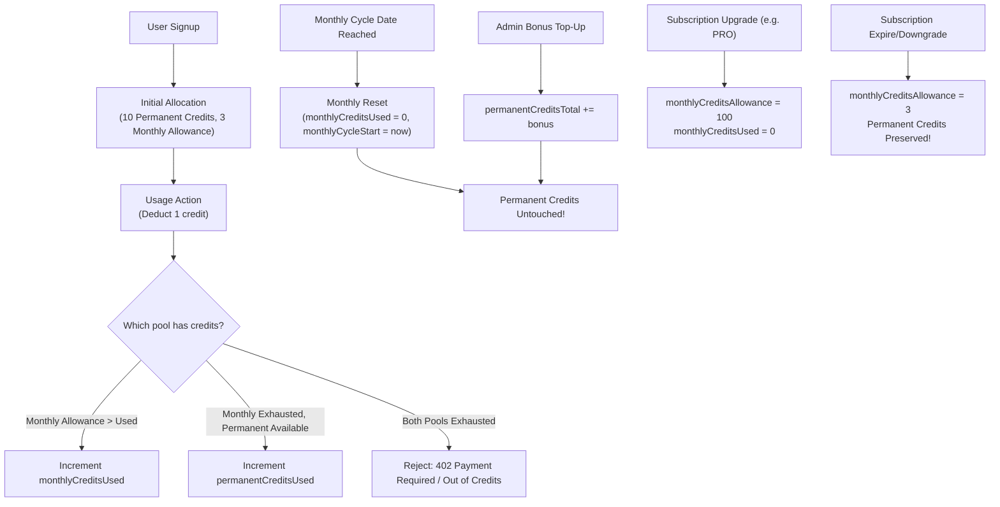

# Phase 7 — Safe Cleanup & Architecture Hardening Plan

**Project:** AI Social Media Studio (ASM)  
**Date:** 2026-09-18  
**Repository Branch:** `master`  
**Status:** Architecture Hardening & Safe Cleanup Specification (Read-Only / Planning Only)

---

## 1. Executive Summary

This document provides a comprehensive, prioritized, dependency-aware implementation plan for hardening and cleaning the AI Social Media Studio (ASM) codebase. Based directly on the verified Phase 5 documentation findings and the Phase 6 file-by-file dependency map (310 total repository files), this plan defines the exact technical specifications, risks, rollback procedures, and test requirements for transitioning the platform from a hybrid development/demo prototype into a secure, robust, production-grade enterprise application.

### Key Objectives
1. **Eliminate Production Authentication Vulnerabilities:** Gate `x-user-id` header overrides and unauthenticated demo-workspace fallbacks strictly behind non-production environments; enforce real Supabase JWT verification and explicit `SUPABASE_SERVICE_ROLE_KEY` requirements in production.
2. **Resolve Prisma / Credit Schema Drift:** Reconcile `packages/database/prisma/schema.prisma` with the applied database migration `1_add_permanent_and_monthly_free_credits/migration.sql`, making the 6 dual-ledger credit columns first-class Prisma model properties and eliminating unsafe type casting and in-memory synchronization bugs.
3. **Fix Credit Lifecycle Inconsistencies:** Decouple permanent rollover credits from monthly replenishing allowances, fixing the critical bug in `usage-service.ts` where monthly cycle resets overwrite admin-granted credits, and resolving the "0/10 credits" dashboard display anomaly.
4. **Classify AI & Social Provider Readiness:** Define concrete migration paths for stubbed video generators (Runway, Luma) and mock OAuth callbacks (Facebook, LinkedIn, TikTok, X, Pinterest, Threads, YouTube).
5. **Standardize Environment Configuration & Deployment:** Reconcile undocumented environment variables with `.env.example`, delineate serverless vs persistent worker runtime responsibilities, and schedule safe archival of 5 verified dead code files.

---

## 2. Current Verified Baseline

The repository is a TypeScript monorepo configured with npm workspaces:
- `apps/api`: Express 4.21 backend (120 source files, 45 API route paths registered across 22 router modules).
- `apps/web`: Next.js 14.2 App Router frontend (78 source files, 14 routes, Tailwind CSS UI).
- `packages/database`: Prisma 7.9 ORM with PostgreSQL (schema definition, client wrapper, SQL migrations).
- `packages/shared`: Shared TypeScript types, Zod schemas, constants, and entitlements (28 source files).
- `packages/config`: Shared ESLint, Prettier, and TypeScript configurations.

### Key Baseline Metrics
- **Total Source Files:** 310 mapped in Phase 6 (API: 120, Web: 78, Shared: 28, Database: 6, Config: 2, Scripts: 3, Tests: 63).
- **Current Active Database Schema:** `packages/database/prisma/schema.prisma` (1,401 lines, 42 models).
- **Database Migrations Applied:** `1_add_permanent_and_monthly_free_credits/migration.sql` altered the `UserUsage` table in PostgreSQL, adding 6 columns not reflected in the schema file.
- **Active Git Commit:** `4e0aaa3a09e0cd5c85ce7973a36b122722069ead` on `master`.

---

## 3. Priority Matrix

| Priority | Area | Risk Level | Direct Dependencies | Proposed Action |
|---|---|---|---|---|
| **P1** | **Production Authentication** | **Critical** | `apps/api/src/middleware/auth.ts`, `apps/api/src/config/supabase.ts` | Strictly gate test/dev bypasses behind `NODE_ENV`; require valid Supabase JWT in production; mandate service role key. |
| **P2** | **Prisma / Credit Schema Alignment** | **High** | `packages/database/prisma/schema.prisma`, `packages/database/src/index.ts` | Add 6 migration columns to `UserUsage` model in `schema.prisma`; run `prisma generate` to update client types without dropping data. |
| **P3** | **Credit System Correctness** | **High** | `apps/api/src/services/usage-service.ts`, `apps/api/src/routes/admin.ts`, `apps/web/components/layout/StudioLayout.tsx` | Fix reset logic overwriting total credits; implement true two-pool subtraction (monthly allowance consumed first, then permanent credits); fix dashboard badge. |
| **P4** | **Environment Configuration** | **Medium** | `.env.example`, `apps/api/src/config/`, `apps/web/` | Add missing variables to `.env.example`; enforce runtime validation via Zod; categorize public vs private secrets. |
| **P5** | **Safe Cleanup Candidates** | **Low** | 5 verified orphaned files across Web, Database, and API | Safely archive or delete 5 files confirmed to have zero active consumers. |
| **P6** | **Worker / Deployment Topology** | **Medium** | `apps/api/src/server.ts`, `apps/api/src/workers/`, `DEPLOYMENT.md` | Separate embedded interval workers from standalone CLI workers; clarify Vercel serverless vs persistent Node server duties. |
| **P7** | **Social Platform Readiness** | **Medium** | `apps/api/src/routes/integrations.ts`, `apps/api/src/integrations/` | Transition mock redirect callbacks into real OAuth2 code-exchange pipelines with encrypted token storage. |
| **P8** | **AI Provider Readiness** | **Medium** | `apps/api/src/integrations/ai/`, `real-video-generation-service.ts` | Implement actual HTTP clients for Runway and Luma or cleanly expose provider capabilities and fallback indicators to UI. |
| **P9** | **Route / Service Architecture** | **Medium** | `apps/api/src/routes/admin.ts`, `apps/api/src/routes/integrations.ts` | Refactor large monolithic route files into modular domain routers and dedicated service modules. |
| **P10** | **Social Engine Architecture** | **Low** | `apps/web/lib/social-engine/`, `apps/api/src/integrations/social-engine/` | Formalize shared validation schemas in `@ai-social/shared` while preserving clean client UI vs server publisher boundaries. |

---

## 4. Authentication Hardening Plan

### 4.1 Vulnerability Analysis of `apps/api/src/middleware/auth.ts`

1. **`x-user-id` Header Override (Lines 140–150):**
   - *Current Code:* Any incoming HTTP request containing an `x-user-id` header immediately authenticates as that user ID, calls `ensureUserExists`, and grants full access without verifying identity, password, or token.
   - *Risk:* In a public production deployment, any attacker who sets `x-user-id: <target-uuid>` can impersonate any user, including administrators.
   - *Remediation:* Enforce that `x-user-id` is strictly permitted **only** when `process.env.NODE_ENV === "test"` or `process.env.NODE_ENV === "development"`. In `production`, this header must be completely ignored or rejected with a 400 Bad Request.

2. **No-Token / Demo Workspace Fallback (Lines 153–162):**
   - *Current Code:* If no `Authorization` header or cookie is provided, `requireAuth` defaults to `req.user = { id: "demo-user-id", email: "demo@maisonlumiere.com" }` and `workspaceId = "demo-workspace-1"`.
   - *Risk:* Unauthenticated requests silently succeed as the demo user instead of returning `401 Unauthorized`. This prevents API endpoints from enforcing real authentication in production.
   - *Remediation:* Environment-gate this fallback. When `process.env.NODE_ENV === "production"`, if `!token`, immediately return `res.status(401).json({ success: false, error: "Unauthorized: Authentication token required" })`. In development, retain demo fallback only if an explicit flag `ENABLE_DEMO_AUTH_FALLBACK=true` is set.

3. **Admin `adm_` Session Token Handling (Lines 119–137):**
   - *Current Code:* Tokens prefixed with `adm_` are verified via `verifyAdminSessionToken(token)` using `ADMIN_SESSION_SECRET`.
   - *Risk:* If `ADMIN_SESSION_SECRET` is missing, it falls back to `"studio-admin-fallback-secret-2026"` in `admin-auth-service.ts`.
   - *Remediation:* In production, require that `ADMIN_SESSION_SECRET` is explicitly defined with minimum entropy (32+ chars). Disallow fallback secret when `NODE_ENV === "production"`.

4. **Supabase JWT Verification (Lines 164–186):**
   - *Current Code:* Calls `supabase.auth.getUser(token)` using `getSupabaseAdminClient()`.
   - *Risk:* Network latency on every API call if not locally verifying JWTs; additionally, if Supabase client is misconfigured, authentication fails or falls back unsafely.
   - *Remediation:* Retain `supabase.auth.getUser(token)` as the authoritative remote check, but evaluate adding local JWT verification (using Supabase JWT secret) for low-latency verification in high-throughput production paths.

5. **Auto User Provisioning / Resolution (`ensureUserExists`, Lines 15–98):**
   - *Current Code:* On every authenticated request, `prisma.user.findFirst` and `prisma.userUsage.upsert` are called.
   - *Risk:* Causes 2 database roundtrips per API request. Furthermore, if DB is offline, it returns an in-memory user object that fails downstream foreign key operations.
   - *Remediation:* Cache user resolution records in an LRU memory cache or Redis session store with a 5-minute TTL. Only provision users on first login / auth webhook, rather than inline in every API request middleware.

### 4.2 Analysis of `apps/api/src/config/supabase.ts`

```typescript
export function getSupabaseAdminClient() {
  const supabaseUrl = process.env.NEXT_PUBLIC_SUPABASE_URL || "https://placeholder-project.supabase.co";
  const supabaseServiceKey = process.env.SUPABASE_SERVICE_ROLE_KEY || process.env.NEXT_PUBLIC_SUPABASE_ANON_KEY || "placeholder-key";
  ...
}
```

- **Security Flaw:** Falling back from `SUPABASE_SERVICE_ROLE_KEY` to `NEXT_PUBLIC_SUPABASE_ANON_KEY`:
  - If the service role key is missing, the server operates using the anonymous client key.
  - The anonymous key cannot bypass Row Level Security (RLS) policies and cannot manage users or inspect private auth tables.
  - If both keys are missing, it falls back to `"placeholder-key"`, masking critical deployment configuration errors until a runtime crash occurs.
- **Remediation Plan:**
  ```typescript
  export function getSupabaseAdminClient() {
    const supabaseUrl = process.env.NEXT_PUBLIC_SUPABASE_URL;
    const supabaseServiceKey = process.env.SUPABASE_SERVICE_ROLE_KEY;

    if (process.env.NODE_ENV === "production") {
      if (!supabaseUrl || supabaseUrl.includes("placeholder")) {
        throw new Error("[SupabaseConfig] NEXT_PUBLIC_SUPABASE_URL is missing or invalid in production.");
      }
      if (!supabaseServiceKey || supabaseServiceKey.includes("placeholder")) {
        throw new Error("[SupabaseConfig] SUPABASE_SERVICE_ROLE_KEY is required in production.");
      }
    }
    // Only in development/test allow mock/fallback clients
    return createSupabaseClient(
      supabaseUrl || "https://placeholder-project.supabase.co",
      supabaseServiceKey || process.env.NEXT_PUBLIC_SUPABASE_ANON_KEY || "placeholder-key",
      { auth: { persistSession: false, autoRefreshToken: false } }
    );
  }
  ```

---

## 5. Prisma / Credit Schema Alignment Plan

### 5.1 The Six Migration Fields
In `packages/database/prisma/migrations/1_add_permanent_and_monthly_free_credits/migration.sql`:
```sql
ALTER TABLE "UserUsage"
ADD COLUMN "permanentCreditsTotal" INTEGER NOT NULL DEFAULT 10,
ADD COLUMN "permanentCreditsUsed" INTEGER NOT NULL DEFAULT 0,
ADD COLUMN "monthlyCreditsAllowance" INTEGER NOT NULL DEFAULT 3,
ADD COLUMN "monthlyCreditsUsed" INTEGER NOT NULL DEFAULT 0,
ADD COLUMN "monthlyCycleStart" TIMESTAMP(3),
ADD COLUMN "lastMonthlyReset" TIMESTAMP(3);
```

### 5.2 Current State in `schema.prisma` (Lines 752–762)
```prisma
model UserUsage {
  id               String   @id @default(uuid())
  userId           String   @unique
  freeCreditsTotal Int      @default(10)
  freeCreditsUsed  Int      @default(0)
  createdAt        DateTime @default(now())
  updatedAt        DateTime @updatedAt
  user             User     @relation(fields: [userId], references: [id], onDelete: Cascade)

  @@index([userId])
}
```

### 5.3 Assessment & Solution
- **Is the migration authoritative?** Yes. Migration 1 has already been executed against the database in production and development environments. The columns exist in PostgreSQL.
- **Should `schema.prisma` be updated?** Yes, absolutely. `schema.prisma` is currently out of sync with the physical database structure.
- **Is a new migration required?** No new SQL migration is required because the columns already exist in the database! However, to ensure Prisma CLI migration tracking remains pristine:
  1. Add the 6 fields directly to `model UserUsage` in `packages/database/prisma/schema.prisma`.
  2. Run `npx prisma generate` to rebuild `@prisma/client`.
  3. Run `npx prisma migrate status` to verify that the database schema and migration history match without drift.
- **Will existing production data be affected?** No. Because the columns already exist in PostgreSQL with defaults, updating `schema.prisma` merely exposes them to TypeScript and Prisma Client queries. No data will be dropped or modified.
- **Current Type Casts / Memory Fallbacks:**
  - `apps/api/src/services/usage-service.ts` currently casts database records: `const dbRecord = record as any;` and accesses `dbRecord.permanentCreditsTotal ?? dbRecord.freeCreditsTotal`.
  - Once `schema.prisma` is aligned, all `as any` casts can be removed, and TypeScript will enforce type safety across `usage-service.ts`, `routes/usage.ts`, and `routes/admin.ts`.

---

## 6. Credit Lifecycle Correctness Plan

### 6.1 Complete Lifecycle Analysis



### 6.2 The Root Cause of "Dashboard Showing 0/10 Credits" and Lost Admin Top-Ups

1. **The Overwrite Bug (`apps/api/src/services/usage-service.ts`, Lines 287–305):**
   ```typescript
   const needsReset =
     !record.lastMonthlyReset ||
     record.lastMonthlyReset < cycleInfo.cycleStart ||
     record.freeCreditsTotal !== currentAllowance || // <--- BUG!
     record.freeCreditsUsed > currentAllowance;

   if (needsReset) {
     record.freeCreditsTotal = currentAllowance;     // <--- Overwrites admin top-ups!
     record.permanentCreditsTotal = currentAllowance; // <--- Destroys permanent pool!
   }
   ```
   - When an administrator tops up a user with 50 credits, `freeCreditsTotal` becomes `60`.
   - On the next API call to `/api/usage` or content generation, `usage-service.ts` checks `record.freeCreditsTotal !== currentAllowance` (`60 !== 3` or `60 !== 10`).
   - It treats this difference as a stale record requiring a reset, and forcefully resets `freeCreditsTotal` and `permanentCreditsTotal` back to `currentAllowance` (3 or 10), wiping out the top-up!

2. **The "0/10 Credits" Display Anomaly:**
   - In Month 1, a new user receives 10 initial credits. If they consume all 10 credits, `freeCreditsUsed = 10`, `freeCreditsRemaining = 0`.
   - The frontend layout (`apps/web/components/layout/StudioLayout.tsx:644-658`) displays:
     `{usage?.remainingCredits ?? 0} / {usage?.monthlyLimit ?? 10}`.
   - When remaining credits reach 0, it displays `0 / 10 credits` with a red badge.
   - In Month 2, when the reset occurs, if `currentAllowance` is switched to 3, but the user is unmigrated or `monthlyLimit` is reported as `freeCreditsTotal` (which was 10), it displays conflicting or 0 values.

3. **Proposed Correction Sequence:**
   - **Step 1:** In `schema.prisma`, formally declare both credit pools in `UserUsage`.
   - **Step 2:** Refactor `usage-service.ts` calculation logic:
     - `availableMonthly = Math.max(0, monthlyCreditsAllowance - monthlyCreditsUsed)`
     - `availablePermanent = Math.max(0, permanentCreditsTotal - permanentCreditsUsed)`
     - `totalRemaining = availableMonthly + availablePermanent`
   - **Step 3:** Implement deduction priority:
     - Deduct first from `monthlyCreditsUsed` (since monthly credits expire at cycle end).
     - Once `monthlyCreditsUsed >= monthlyCreditsAllowance`, deduct from `permanentCreditsUsed`.
   - **Step 4:** Fix `needsReset`:
     - Only reset when `record.lastMonthlyReset < cycleInfo.cycleStart`.
     - During reset: only set `monthlyCreditsUsed = 0` and update `lastMonthlyReset = now`.
     - **NEVER** overwrite `permanentCreditsTotal` or `permanentCreditsUsed` during monthly reset!
   - **Step 5:** Fix Admin Top-Up (`routes/admin.ts:468`):
     - Admin bonus credits must increment `permanentCreditsTotal += additional`, leaving monthly allowance untouched.

---

## 7. AI Provider Readiness Matrix

| Provider | Area / Service | Current Classification | Capabilities & Implementation Status | Gap to Full Production |
|---|---|---|---|---|
| **OpenAI Text** | `integrations/ai/text-provider.ts` | **REAL IMPLEMENTATION** | Live `fetch` to OpenAI API (`gpt-4o`, `gpt-4o-mini`). Includes fallback to deterministic mock if `OPENAI_API_KEY` is missing or in mock mode. | Production-ready. Requires valid `OPENAI_API_KEY`. |
| **OpenAI Image** | `integrations/ai/provider.ts` | **REAL IMPLEMENTATION** | Live `fetch` to OpenAI DALL-E 3 API (`v1/images/generations`). Includes fallback to mock SVG/Unsplash if key is absent. | Production-ready. Requires valid `OPENAI_API_KEY`. |
| **ElevenLabs** | `services/voiceover-service.ts` | **REAL IMPLEMENTATION** | Live `fetch` to ElevenLabs API (`v1/text-to-speech/{voiceId}`). Returns MP3 audio buffers. | Production-ready. Requires valid `ELEVENLABS_API_KEY`. |
| **Runway Gen-3** | `integrations/ai/video-generation-provider.ts` | **STUB** | Class exists, validates key format, but unconditionally throws `ProviderError("AUTHENTICATION", "Runway API key is not configured.")`. `real-video-generation-service.ts` catches this and falls back to mock video. | **Requirements for Real Implementation:**<br/>1. Integrate Runway REST API (`https://api.dev.runwayml.com/v1/tasks`).<br/>2. Implement polling / webhook task listener for video rendering status (`PENDING` -> `RUNNING` -> `SUCCEEDED`).<br/>3. Download output MP4 and upload to Supabase Storage. |
| **Luma Dream Machine** | `integrations/ai/video-generation-provider.ts` | **STUB** | Class exists, validates key format, but unconditionally throws `ProviderError("AUTHENTICATION", "Luma API key is not configured.")`. Falls back to mock. | **Requirements for Real Implementation:**<br/>1. Integrate Luma REST API (`https://api.lumalabs.ai/dream-machine/v1/generations`).<br/>2. Implement polling for generation state (`dreaming` -> `completed`).<br/>3. Persist output URL to database and asset store. |
| **Mock Video Provider** | `integrations/ai/video-generation-provider.ts` | **MOCK** | Fully functional in-memory/simulated video generator returning sample video URLs (e.g. Big Buck Bunny / Pexels CDN) with realistic delays. | Ideal for test and local dev; should be disallowed in production unless `ENABLE_MOCK_AI=true`. |
| **Provider Config** | `config/provider-config.ts` | **CONFIGURATION-ONLY** | Central registry reading environment variables to determine default active providers for text, image, and video. | Needs schema validation to prevent misconfigurations at server startup. |

---

## 8. Social Platform Readiness Matrix

The application supports 8 social platforms across `apps/api/src/routes/integrations.ts`, `apps/api/src/integrations/social-engine/`, and `apps/api/src/integrations/instagram/`.

| Platform | 1. OAuth Auth URL | 2. OAuth Callback | 3. Code Exchange | 4. Token Persistence | 5. Token Encryption | 6. Refresh / Expiry | 7. Publishing API | 8. Analytics API | 9. Mock Fallback | 10. Required Env Vars |
|---|---|---|---|---|---|---|---|---|---|---|
| **Instagram** | **Yes** | **Yes** | **Yes** | **Yes** (`InstagramAccount`) | **Yes** (AES-256-GCM) | **Yes** (60-day long-lived) | **Yes** (Graph API Carousel/Reels) | **Yes** (Graph Insights) | **Yes** | `META_CLIENT_ID`, `META_CLIENT_SECRET` |
| **Facebook** | **Yes** | **Mock** | **No** | **No** | **No** | **No** | **Partial** (`social-engine`) | **No** | **Yes** | `FACEBOOK_APP_ID`, `FACEBOOK_APP_SECRET` |
| **LinkedIn** | **Yes** | **Mock** | **No** | **No** | **No** | **No** | **Partial** (`social-engine`) | **No** | **Yes** | `LINKEDIN_CLIENT_ID`, `LINKEDIN_CLIENT_SECRET` |
| **TikTok** | **Yes** | **Mock** | **No** | **No** | **No** | **No** | **Partial** (`social-engine`) | **No** | **Yes** | `TIKTOK_CLIENT_KEY`, `TIKTOK_CLIENT_SECRET` |
| **X (Twitter)**| **Yes** | **Mock** | **No** | **No** | **No** | **No** | **Partial** (`social-engine`) | **No** | **Yes** | `TWITTER_API_KEY`, `TWITTER_API_SECRET` |
| **Pinterest** | **Yes** | **Mock** | **No** | **No** | **No** | **No** | **Partial** (`social-engine`) | **No** | **Yes** | `PINTEREST_APP_ID`, `PINTEREST_APP_SECRET` |
| **Threads** | **Yes** | **Mock** | **No** | **No** | **No** | **No** | **Partial** (`social-engine`) | **No** | **Yes** | `THREADS_APP_ID`, `THREADS_APP_SECRET` |
| **YouTube** | **Yes** | **Mock** | **No** | **No** | **No** | **No** | **Partial** (`social-engine`) | **No** | **Yes** | `YOUTUBE_CLIENT_ID`, `YOUTUBE_CLIENT_SECRET` |

*Note on "Mock Callback":* In `apps/api/src/routes/integrations.ts` (lines 165–278), callbacks for Facebook, LinkedIn, TikTok, X, Pinterest, Threads, and YouTube do not process the incoming `code` parameter; they execute a client-side redirect: `res.redirect("${webBaseUrl}/settings/integrations?connected=<platform>")`. Real production deployment of these platforms requires implementing code exchange and saving encrypted access tokens into the `SocialAccount` model.

---

## 9. Environment Variable Inventory

| Variable | Used By | Required In Prod? | Secret? | In Current `.env.example`? | Notes / Assessment |
|---|---|---|---|---|---|
| `PORT` | API (`server.ts`) | No (defaults 3001) | No | Yes | Standard Express port. |
| `NODE_ENV` | API & Web | Yes | No | Yes | `development`, `test`, `production`. |
| `DATABASE_URL` | Prisma Client | Yes | **Yes** | Yes | PostgreSQL connection string. |
| `DIRECT_URL` | Prisma Client | Optional | **Yes** | No | Direct Supabase connection for migrations (bypasses pgbouncer). |
| `NEXT_PUBLIC_SUPABASE_URL` | Web & API | Yes | No | Yes | Supabase project URL. |
| `NEXT_PUBLIC_SUPABASE_ANON_KEY`| Web & API | Yes | No | Yes | Public Supabase anon key. |
| `SUPABASE_SERVICE_ROLE_KEY` | API (`config/supabase.ts`) | **Yes** | **Yes** | Yes | Required for backend admin auth checks. |
| `TOKEN_ENCRYPTION_KEY` | API (`token-encryption.ts`) | **Yes** | **Yes** | Yes | 64-char hex key for AES-256 encryption. |
| `ADMIN_SESSION_SECRET` | API (`admin-auth-service.ts`)| **Yes** | **Yes** | **No (MISSING)** | Secret for signing `adm_` session tokens. |
| `ADMIN_INITIAL_EMAIL` | API (`admin-auth-service.ts`)| Yes | No | **No (MISSING)** | Seed admin email. |
| `ADMIN_INITIAL_PASSWORD` | API (`admin-auth-service.ts`)| **Yes** | **Yes** | **No (MISSING)** | Seed admin password. |
| `OPENAI_API_KEY` | API (`integrations/ai/`) | Yes | **Yes** | Yes | Used for copy generation & DALL-E. |
| `ELEVENLABS_API_KEY` | API (`voiceover-service.ts`) | Optional | **Yes** | Yes | Used for audio voiceovers. |
| `RUNWAY_API_KEY` | API (`video-generation-provider.ts`)| Optional | **Yes** | Yes | Video generation key. |
| `LUMA_API_KEY` | API (`video-generation-provider.ts`)| Optional | **Yes** | Yes | Video generation key. |
| `FRONTEND_URL` | API (`integrations.ts`, CORS) | Yes | No | Yes | Origin URL for CORS and OAuth redirects. |
| `META_CLIENT_ID` | API (`routes/instagram.ts`) | Optional | No | Yes | Meta App ID for Instagram Graph API. |
| `META_CLIENT_SECRET` | API (`routes/instagram.ts`) | Optional | **Yes** | Yes | Meta App Secret for Instagram Graph API. |
| `META_API_VERSION` | API (`routes/instagram.ts`) | No | No | **No (MISSING)** | Defaults to `v20.0`. |
| `REDIS_URL` | API (`queues/`) | No | **Yes** | **No (MISSING)** | Redis connection URL for BullMQ. |
| `ALLOW_HTTP_WEBHOOKS` | API (`webhook-security.ts`)| No (Dev only) | No | **No (MISSING)** | Flag to bypass HTTPS for local ngrok webhooks. |
| `GEMINI_API_KEY` | Unused | No | **Yes** | **Yes (OBSOLETE)**| In `.env.example` but nowhere in code. |
| `ENABLE_BACKGROUND_PUBLISHING_WORKER` | Unused | No | No | **Yes (MISLEADING)**| In `.env.example`, but `server.ts` always calls `startPublishingWorker()`. |

---

## 10. Worker / Deployment Architecture Plan

### 10.1 Current Worker Topology
1. **Embedded Publishing Worker (`apps/api/src/workers/publishing-worker.ts`):**
   - Automatically started inside `apps/api/src/server.ts` upon `app.listen()` via `startPublishingWorker()`.
   - Uses an in-memory `setInterval` (polling every 30 seconds) querying `prisma.scheduledPublication`.
   - *Advantage:* Requires no external infrastructure (runs without Redis).
   - *Limitation:* Does not scale horizontally (running 3 API server instances will poll and execute jobs 3 times concurrently without distributed DB locking).
2. **Standalone Workers (`generationWorker.ts`, `publishingWorker.ts`, `analyticsWorker.ts`):**
   - Defined as CLI scripts (`npm run worker:*`).
   - `publishingWorker.ts` currently only logs an initialization message.
   - `generation-worker.ts` and `instagram-analytics-worker.ts` contain comprehensive background polling and retry logic.
3. **BullMQ Queues (`apps/api/src/queues/`):**
   - Connects to `REDIS_URL`. If Redis is offline or not configured, initialization logs warnings.
4. **Vercel Serverless Implications:**
   - On Vercel (or AWS Lambda), background `setInterval` timers are terminated when the serverless function freezes after responding to an HTTP request.
   - Therefore, the embedded publishing worker **cannot** reliably execute on serverless infrastructure.

### 10.2 Recommended Deployment Topology

```
+-------------------------------------------------------------------------+
|                               VERCEL                                    |
|  +---------------------------+        +------------------------------+  |
|  |   apps/web (Next.js 14)   |        |   apps/api (Express API)     |  |
|  |   - Server-Side Rendering |        |   - Stateless HTTP Endpoints |  |
|  |   - Static Assets         |        |   - Supabase Auth Check      |  |
|  +-------------+-------------+        +--------------+---------------+  |
+----------------|-------------------------------------|------------------+
                 |                                     |
                 v                                     v
+-------------------------------------------------------------------------+
|                          PERSISTENT SERVICES                            |
|                                                                         |
|  +------------------------+             +----------------------------+  |
|  | Supabase (Auth + DB)   |<------------| Railway / Render / Fly.io  |  |
|  | - PostgreSQL 15        |             | (Persistent Node Worker)   |  |
|  | - Storage Buckets      |             | - Publishing Worker        |  |
|  | - Realtime Subscriptions             | - Analytics Poller         |  |
|  +------------------------+             | - Media Generation Worker  |  |
|                                         +--------------+-------------+  |
|                                                        |                |
|                                                        v                |
|                                         +----------------------------+  |
|                                         | Upstash Redis (BullMQ)     |  |
|                                         | - Job Queues & Rate Limits |  |
|                                         +----------------------------+  |
+-------------------------------------------------------------------------+
```

- **Vercel:** Hosts `apps/web` and stateless HTTP endpoints in `apps/api`. `startPublishingWorker()` should be disabled when running in serverless mode via `DISABLE_EMBEDDED_WORKERS=true`.
- **Persistent Worker Host (Railway, Render, or AWS ECS):** Runs `node dist/workers/publishing-worker.js` and `analytics-worker.js` as continuously running container processes.
- **External Cron / Trigger:** Alternatively, use Vercel Cron or GitHub Actions to invoke an authenticated HTTP endpoint (e.g. `POST /api/internal/workers/trigger-publishing`) every minute.

---

## 11. Safe Cleanup Candidates

The 5 candidates identified in Phase 6 have been verified to have **zero consumers** across the codebase:

### 1. `apps/web/components/ui/InstagramIcon.tsx`
- **Verification:** Grep search shows zero imports. An identical, actively used component exists at `apps/web/components/icons/InstagramIcon.tsx` (consumed by `StudioLayout.tsx`, `IntegrationSettings.tsx`, etc.).
- **Build / Test Implications:** None. No file imports this component.
- **Recommendation:** Archive to `docs/archive/stubs/` or safely delete.
- **Pre-Deletion Check:** Run `rg "components/ui/InstagramIcon"` across the entire project.

### 2. `packages/database/prisma/original-schema.prisma`
- **Verification:** 98 KB unreferenced file left over from early schema migrations. `package.json` build scripts explicitly target `./prisma/schema.prisma`.
- **Build / Test Implications:** None.
- **Recommendation:** Delete or archive. It introduces confusion when searching Prisma models.
- **Pre-Deletion Check:** Ensure git history retains the commit where it was added.

### 3. `apps/api/src/utils/logger.ts`
- **Verification:** Zero imports. The API exclusively imports the Winston logger from `apps/api/src/config/logger.ts`.
- **Build / Test Implications:** None.
- **Recommendation:** Safely delete.
- **Pre-Deletion Check:** Run `rg "utils/logger"` across `apps/api`.

### 4. `apps/web/components/studio/BulkImageUploader.tsx`
- **Verification:** Orphaned experimental UI component. Studio page uses `ImageUploader.tsx` and `MediaAssetGrid.tsx`.
- **Build / Test Implications:** None.
- **Recommendation:** Move to `apps/web/components/studio/_archived/` or delete.
- **Pre-Deletion Check:** Run `rg "BulkImageUploader"` across `apps/web`.

### 5. `apps/web/components/UsageWidget.tsx`
- **Verification:** Orphaned standalone widget. `StudioLayout.tsx` implements its own inlined credit badge and progress bar.
- **Build / Test Implications:** None.
- **Recommendation:** Archive or delete.
- **Pre-Deletion Check:** Run `rg "UsageWidget"` across `apps/web`.

---

## 12. Social Engine Architecture

### 12.1 Evaluation of `apps/web/lib/social-engine/` vs `apps/api/src/integrations/social-engine/`
A surface-level review might suggest consolidating these two folders because they share the name "social-engine". However, an in-depth architectural audit reveals that **the separation is intentional and correct**:

1. **Frontend (`apps/web/lib/social-engine/`):**
   - *Role:* Pure client-side UI simulation, character count validation, aspect ratio enforcement, and real-time DOM previews (rendering simulated Instagram cards, LinkedIn feeds, X cards).
   - *Dependencies:* React, DOM utilities, Lucide icons.
   - *Security Boundary:* Must **never** bundle or import API secrets, token encryption keys, or private platform credentials.
2. **Backend (`apps/api/src/integrations/social-engine/`):**
   - *Role:* Server-side publishing adapters, HTTP clients, media multipart uploaders, rate-limit handlers, and token decryption routines.
   - *Dependencies:* Axios, Winston logger, Prisma, AES-256 crypto.
   - *Security Boundary:* Must execute exclusively on the server to protect client secrets and access tokens.

### 12.2 Recommended Future Refactoring
Do **not** merge the folders. Instead:
- Extract common constants and platform specifications (character limits, supported aspect ratios, platform enums) into `packages/shared/src/schemas/social.ts`.
- Both frontend and backend can import validation rules from `@ai-social/shared` without coupling React components to server HTTP clients.

---

## 13. API Route / Service Architecture

The API exposes 45 endpoints registered across 22 router files. The following architectural anti-patterns must be remediated:

1. **Monolithic Controller: `apps/api/src/routes/admin.ts` (700+ lines):**
   - Combines admin login, session verification, user pagination, plan modification, credit top-ups, system metrics, and database backup endpoints in a single file.
   - *Remediation:* Split into:
     - `routes/admin/auth.ts`
     - `routes/admin/users.ts`
     - `routes/admin/credits.ts`
     - `routes/admin/system.ts`
2. **Mock Callback Proliferation: `apps/api/src/routes/integrations.ts`:**
   - Houses 7 mock callback endpoints that only execute browser redirects.
   - *Remediation:* Create an extensible `SocialOAuthService` interface that handles state verification, code exchange, and token encryption uniformly.
3. **Missing Service Layer Boundaries:**
   - `apps/api/src/routes/campaigns.ts` executes inline Prisma queries directly inside route handlers rather than delegating to a `campaign-service.ts`.
4. **Unprotected Operational Endpoints:**
   - `GET /metrics` in `apps/api/src/server.ts` is publicly accessible without authentication or IP whitelisting. In production, this leaks internal operational metrics. Must be protected by `requireAdmin` or internal network gating.

---

## 14. Test Strategy

To prevent regressions during execution, the following test suite must be established:

### 14.1 Tests Required BEFORE High-Risk Changes

```
+-------------------------------------------------------------------------+
|                         PRE-HARDENING TEST PLAN                         |
+-------------------------------------------------------------------------+
| 1. AUTHENTICATION (apps/api/test/auth.test.ts)                          |
|    - Verify x-user-id succeeds in NODE_ENV=test.                        |
|    - Verify x-user-id returns 401/400 in NODE_ENV=production.           |
|    - Verify missing token returns 401 in NODE_ENV=production.           |
|    - Verify adm_ token with invalid secret returns 401.                 |
+-------------------------------------------------------------------------+
| 2. PRISMA SCHEMA & MIGRATION (packages/database/test/schema.test.ts)    |
|    - Run prisma validate and verify no drift against migration 1.       |
|    - Query all 6 UserUsage fields using @prisma/client.                 |
+-------------------------------------------------------------------------+
| 3. CREDIT LIFECYCLE (apps/api/test/usage-service.test.ts)               |
|    - Signup: assert 10 permanent credits, 3 monthly allowance.          |
|    - Deduction: assert monthly allowance is deducted before permanent.  |
|    - Monthly Reset: assert permanent pool is NOT overwritten.           |
|    - Admin Top-Up: assert top-up persists across monthly reset cycles.  |
+-------------------------------------------------------------------------+
| 4. FRONTEND DASHBOARD (apps/web/test/StudioLayout.test.tsx)             |
|    - Assert credit badge displays "X / Y credits" accurately.           |
|    - Assert 0 credits remaining renders warning banner without crash.   |
+-------------------------------------------------------------------------+
```

### 14.2 Test Suite Categorization
- **Unit:** Test encryption/decryption in `token-encryption.ts`, credit math in `usage-service.ts`, Zod validation in `packages/shared`.
- **Integration:** Supertest runs against Express routes with an in-memory SQLite / PostgreSQL test container.
- **Security:** Static analysis checking for unauthenticated routes and auditing `NODE_ENV` gates.
- **Smoke Tests:** Container startup checks ensuring that missing production secrets halt startup with clear error messages.

---

## 15. Exact Future Implementation Sequence

Execution should be carried out in small, strictly verified phases:

```
Phase 8A: Production Authentication Hardening
  ├── Gate x-user-id behind NODE_ENV !== "production"
  ├── Gate demo fallback behind ENABLE_DEMO_AUTH_FALLBACK
  ├── Enforce SUPABASE_SERVICE_ROLE_KEY check in config/supabase.ts
  └── Test: auth.test.ts passes in both test and production modes

        ↓ VERIFY & PASS TESTS

Phase 8B: Prisma Schema Alignment
  ├── Add 6 columns to model UserUsage in packages/database/prisma/schema.prisma
  ├── Run npx prisma generate in packages/database
  ├── Remove "as any" type casts in usage-service.ts
  └── Test: database typecheck and Prisma client query tests pass

        ↓ VERIFY & PASS TESTS

Phase 8C: Credit Lifecycle Logic Correction
  ├── Separate permanent and monthly allowance pools in usage-service.ts
  ├── Fix line 287-295 overwrite bug during monthly reset
  ├── Update admin top-up route to increment permanentCreditsTotal
  ├── Reconcile GET /api/usage response payload
  └── Test: usage-service.test.ts and admin credit top-up tests pass

        ↓ VERIFY & PASS TESTS

Phase 8D: Environment Configuration & Secret Hardening
  ├── Update .env.example with missing variables (ADMIN_SESSION_SECRET, etc.)
  ├── Remove obsolete GEMINI_API_KEY from .env.example
  ├── Add startup schema validation for environment variables
  └── Test: API server starts with valid .env and fails cleanly with missing secrets

        ↓ VERIFY & PASS TESTS

Phase 8E: Safe Removal / Archival of Dead Code
  ├── Archive/remove the 5 confirmed dead files
  ├── Verify build: npm run build across all packages
  └── Test: full regression suite passes

        ↓ VERIFY & PASS TESTS

Phase 8F: Route & Service Boundary Decoupling
  ├── Split admin.ts into modular route controllers
  ├── Restrict GET /metrics behind admin authorization
  └── Test: all 45 API routes remain functional with identical contracts
```

---

## 16. Rollback Strategy

Each phase maintains an immediate rollback mechanism:

1. **Phase 8A (Auth):**
   - *Rollback:* Revert `apps/api/src/middleware/auth.ts` and `apps/api/src/config/supabase.ts` via `git checkout HEAD~1 <files>`. Re-enables demo fallback immediately.
2. **Phase 8B (Prisma):**
   - *Rollback:* Revert `schema.prisma` edit and re-run `npx prisma generate`. Because no database drop/migration was executed, PostgreSQL database tables remain completely unharmed.
3. **Phase 8C (Credits):**
   - *Rollback:* Revert `usage-service.ts`. If any corrupted user usage records were saved during testing, run a compensating SQL script to restore `freeCreditsTotal = permanentCreditsTotal`.
4. **Phase 8D (Env):**
   - *Rollback:* Revert `.env.example`.
5. **Phase 8E (Dead Code):**
   - *Rollback:* If an unexpected runtime import was missed, restore deleted files instantly from Git history (`git checkout HEAD~1 <file-path>`).

---

## 17. Risks and Unknowns

1. **Unmigrated Production User Records:**
   - *Risk:* Existing users in the database created prior to Migration 1 may have `NULL` for `permanentCreditsTotal` or `monthlyCreditsAllowance`.
   - *Mitigation:* Before switching `usage-service.ts` to strictly rely on the new columns, run a one-time data backfill script:
     `UPDATE "UserUsage" SET "permanentCreditsTotal" = COALESCE("freeCreditsTotal", 10), "monthlyCreditsAllowance" = 3 WHERE "permanentCreditsTotal" IS NULL;`
2. **Staging / QA Automated Scripts:**
   - *Risk:* External integration tests or QA scripts may currently rely on passing `x-user-id: test-user`.
   - *Mitigation:* Ensure `NODE_ENV=test` or `NODE_ENV=staging` allows this header if explicitly configured via `ALLOW_HEADER_AUTH=true`.
3. **BullMQ / Redis Dependency:**
   - *Risk:* If standalone worker processes are launched in an environment without Redis, BullMQ will continuously attempt reconnections.
   - *Mitigation:* Retain the embedded worker fallback for single-instance container deployments where Redis is not provisioned.

---

## 18. Phase 8 Recommendation

It is recommended to proceed to **Phase 8A (Production Authentication Hardening)** and **Phase 8B (Prisma Schema Alignment)** first. These two phases address critical security exposure and schema drift, have zero impact on visual frontend code, and establish a rock-solid foundation for the Phase 8C credit system overhaul.

*End of Phase 7 Hardening Plan.*
